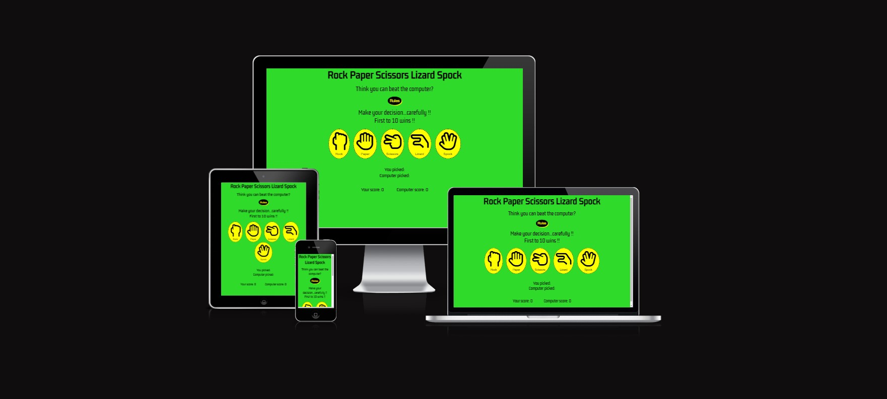
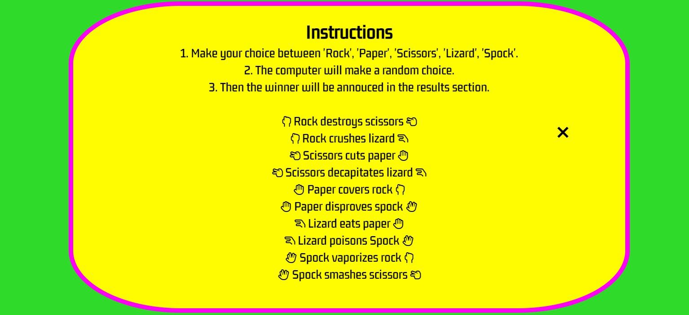
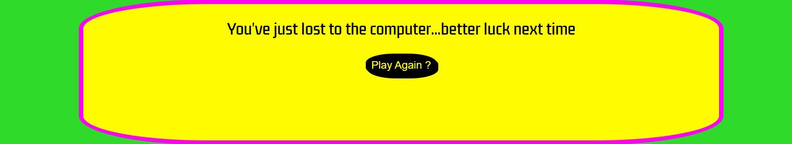
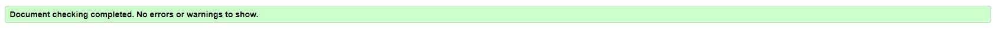
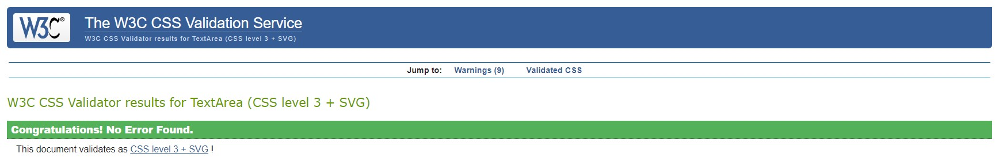
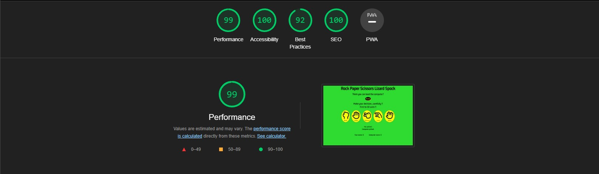

# Rock Paper Scissors Lizard Spock

Rock Paper Scissors Lizard Spock is a twist on the classic game of Rock Paper Scissors which originated on the show The Big Bang Theory. The purpose of the game is to entertain both new and returning users by allowing them to compete against the computer, where the first to win 10 rounds wins the overall game. For a first-time user there is a rule section that clearly indicates all winning scenarios for each selection. The figure needed for the user or computer is displayed clearly in a paragraph below the rules. The game also validates the user inputs (rock, paper, scissors, lizard or spock) and gives feedback to the user where needed. Feedback is provided for each round with text and the scoreboard is updated after each round increasing the score of the user score or the computer score depending on who wins the round. Feedback is also provided at the end of the game by an end-of-game modal which pops up announcing the winner and gives the user the chance to play again.

## User Experience (UX)
### User Stories

* As a user, I want to play a game that has elements of chance.
* As a user, I want to be able to see the rules of the game.
* As a user, I want to see feedback on my choice and the choice of the computer.
* As a user, I want to see who won the round.
* As a user, I want to see the scores incrementing for whoever won the round. 
* As a user, I would like the opportunity to play again when the game is over.

## Features
### Title
*   The title text is very clear and concise and the top and center of the page.
*   The title stays prominent and clear on all screen sizes.

### Taglines and Rules Button
* When the player opens the homepage, they are met with the tagline "Think you can beat the computer?" and "Make your decision...carefully" underneath the title.
* This intrigues the user but also lets them know that the gameplay is based on choices.
* In this section it also lets the user know how many points (rounds) it takes to win the game.
* The rules modal box pops up whenever the user clicks the rules button.
* The rules button has yellow shadowing behind it to add to the effect that it is a button.

### Rules Modal
* The rules modal displays all the possible ways of winning a round of the game. 
* The X in the top right corner of the modal when clicked will close the modal and return you to the game screen.

### User Options (Rock, Paper, Scissors, Lizard, Spock)
* This section has all possible selections the user can make.
* The buttons when hovered over gradually change to the color pink to indicate to the user that this is the selection they are about to make.
* Each button icon matches the icons in the rules modal so the user knows which icon is which.

### User and Computer Selections 
* This section displays what option the user has selected and also the random selection of the computer.

### Round Feedback
* The round feedback section displays which selection has won out of the user selection and computer selection.
* It also displays a tagline to clarify whether the user or computer has won the round.

### Score Board
* Displays the number of rounds won by the user and computer so the user can see how close they are to a victory or a loss.
* Once the user or computer reaches the max score of 10 an end-of-game modal will pop up.

### End Game Modal
* The end game modal pops up when either the user or computer has reached a score of 10.
* The modal announces who has won the game.
* The modal includes a 'Play Again' button which when clicked will reset the game and you can start the game again. 

### Future Features
* I'd like to implement a username input to make the game more personalized.
* Also add a leaderboard that would tally up all the games you won and put your username beside your score.

## Solved Bugs
* I came across a problem with the user and computer scores not incrementing after the first round of selections. To fix this I simply changed the javascript code from userPoints++ to ++userPoints and the same switch for the computer points.
* I had a problem with the rules modal not appearing on top of the rest of the content and to fix this I set the z-index to 1.
## Unsolved Bugs
* When the user opens the rules modal they should be able to close the modal by clicking anywhere on the window however, this only works when the user clicks a certain part of the window. Although the user can't close the modal this way they can still close it using the 'X' button. 

## Testing
### Validator Testing
#### HTML
 * I used the W3C Markup validator to test my code was of good quality, and the validator returned no errors.
 
#### CSS
* I used the W3C CSS validator to test my CSS was of good quality, and the validator returned no errors.

#### JavaScript
* 
#### Lighthouse
* I used lighthouse from chrome dev tools to make sure the page was accessible and easy to read.

#### Responsiveness
* I tested the responsiveness of the page using chrome dev tools throughout the making of the page.
* I used [Responsive Design Checker](https://responsivedesignchecker.com/) to check the page worked on multiple different screen sizes.

## Deployment
The site was deployed to GitHub pages. The steps to deploy are as follows:

1. From the GitHub repository click on "settings" from the navigation bar.
2. Click on "pages" from the navigation section on the left.
3. In the "source" section choose which branch you want to use from the dropdown menu, it will usually be the "main".
4. Select which folder you want to use, in most cases it's the "/root".
5. Hit the "save" button, then wait for your site to be published. (This can take some time.).
6. When your site is ready and published the link will be above the "source" section.

[The live link can be found here](https://conor-b1995.github.io/p2-rockPaperScissors/)

## Credits
### Media
* The font used in this project is Kdam Thmor Pro and I got this font from [Google Fonts](https://fonts.google.com/).
* The icons used for the user options section of the game were taken from [Font Awesome](https://fontawesome.com/). 
### Content
* The help with the 'flex' for the scoreboard section and for the shadowing on the 'Rules' and 'Play Again' buttons came from [Kevin Powell](https://www.youtube.com/kepowob).
* [W3 Schools](https://www.w3schools.com/howto/howto_css_modals.asp) 'How to' tutorial helped me create the rules modal and end game modal. 
* I got some help with the functions in my Javascript code from [freeCodeCamp.org](https://www.youtube.com/c/Freecodecamp) 
### Acknowledgements
Id like to thank my mentor Anthony Ugwu for all his help and guidance through this project.

